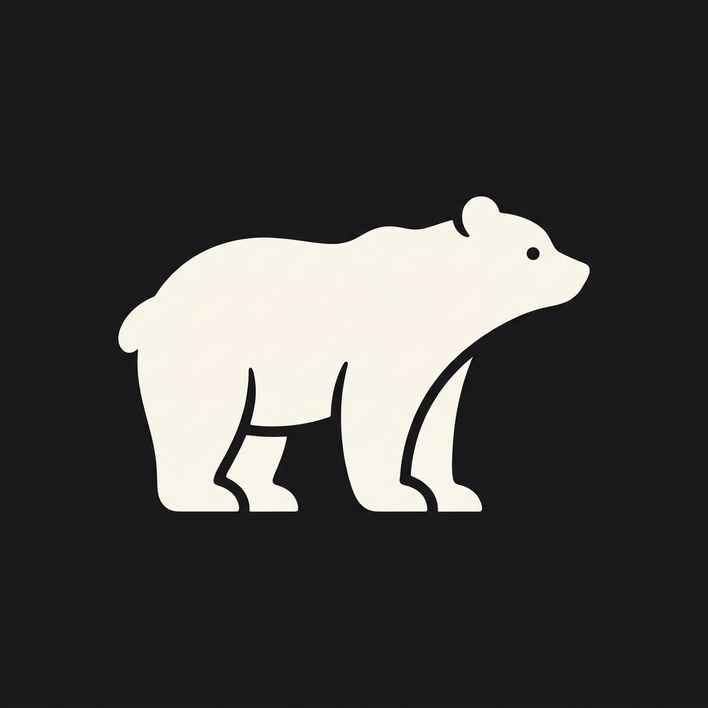

# BearTheme 🐻

**Uma coleção definitiva de 23 temas elegantes, confortáveis e marcantes para o Visual Studio Code.**

---

## 🌟 O que é o BearTheme?

O **BearTheme** é uma suíte completa com **23 variações de temas** cuidadosamente projetadas para todos os estilos e ambientes de trabalho. Todos os temas possuem suporte completo tanto para **destaque de sintaxe (TextMate com 60 regras de tokens)** quanto para a **interface completa do editor (workbench com mais de 85 cores)**, abrangendo Activity Bar, Side Bar, Terminal Integrado, Abas, Status Bar, Breadcrumbs e Git Decorations.

---

## 🎨 Catálogo Completo (23 Variações)

### 🔥 Coleção Marcantes & Conceito (Diferentões de Alto Impacto)

#### ☀️ Claros
* **Bear Cyberpunk Neo-Tokyo (Light)** — Estética industrial sci-fi clara ("Mirror's Edge"). Fundo titânio limpo (`#f2f4f8`), vermelho laser (`#ff003c`) e ciano elétrico (`#00b4d8`).
* **Bear Terracotta & Clay (Light)** — Orgânico e editorial. Linho cru (`#f5ede6`), terracota queimado (`#b84a39`), verde oliva (`#415234`) e azul petróleo.
* **Bear Solar Flare (Light)** — Altíssimo contraste para ambientes muito iluminados. Marfim dourado (`#fffdf2`), azul cobalto profundo (`#1a365d`) e laranja solar (`#ea580c`).
* **Bear Lavender Cloud (Light)** — Visual vaporwave sonhador. Névoa lilás suave (`#f7f4fc`), violeta elétrico (`#7c3aed`), rosa chiclete retrô e azul centáurea.
* **Bear Terminal 90s (Light)** — Nostalgia pura de terminais clássicos e formulário contínuo. Papel bege vintage (`#f2ecdb`), preto fita matricial (`#181716`) e verde fósforo (`#2e7d32`).

#### 🌙 Escuros
* **Bear Obsidian Blood (Dark)** — Dark fantasy e gótico. Fundo preto obsidiana com subtom rubi (`#0d0507`), vermelho carmesim vibrante (`#ff1744`), escarlate e ouro antigo.
* **Bear Matrix Acid (Dark)** — O clássico terminal hacker levado ao extremo. Fundo piche (`#050805`), verde neon radiotóxico (`#39ff14`) e limão elétrico (`#ccff00`).
* **Bear Deep Abyss (Dark)** — Profundezas abissais oceânicas. Azul-abismo ultra profundo (`#020b14`), água-viva ciano fosforescente (`#00ffff`) e coral magenta elétrico (`#ff00a0`).
* **Bear Volcanic Magma (Dark)** — Pedra basáltica e lava incandescente. Carvão vulcânico (`#141111`), laranja brasa ardente (`#ff5722`) e amarelo enxofre (`#ffea00`).
* **Bear Synthwave Sunset 84 (Dark)** — Retrowave / Outrun anos 80. Roxo arcade profundo (`#120826`), rosa fúcsia neon (`#ff007f`), pôr-do-sol laranja neon (`#ff7700`) e ciano laser.

---

### 🍦 Coleção Pastel (Estilo Catppuccin)
Tons aveludados, macios e suaves que reduzem ao máximo o cansaço visual:

* **Bear Pastel Latte (Light)** — Base manteiga suave (`#eff1f5`), safira (`#1e66f5`) e lavanda (`#7287fd`).
* **Bear Pastel Matcha (Light)** — Estética de chá verde matcha (`#5c834a`) com creme e sálvia.
* **Bear Pastel Blossom (Light)** — Suavidade floral sakura com tons de rosa leitoso (`#faf4f6`) e ametista (`#8c52ff`).
* **Bear Pastel Mocha (Dark)** — A clássica paleta aveludada com fundo ardósia escura (`#1e1e2e`) e toques pastel.
* **Bear Pastel Frappé (Dark)** — Tom cinza-ardósia médio fresco (`#303446`), ideal para noites confortáveis de código.
* **Bear Pastel Macchiato (Dark)** — Café expresso aveludado com base quente (`#24273a`) e canela suave (`#f5a97f`).

---

### 🌿 Coleção Natureza & Ártico
* **Bear Polar (Light)** — 100% branco e gélido (`#ffffff`), com destaques em azul glacial (`#0284c7`) e ciano ártico.
* **Bear Honey (Light)** — Marfim e papiro claro com tons acolhedores de mel dourado (`#d97706`) e cedro.
* **Bear Forest (Dark)** — O espírito do Urso Pardo e florestas densas. Verde obsidiana (`#0c1411`) e esmeralda (`#10b981`).
* **Bear Midnight (Dark)** — Ardósia espacial profunda (`#080d1a`), azul estelar (`#38bdf8`) e lavanda cósmica (`#c084fc`).

---

### ⚡ Coleção Clássica & Synthwave
* **Bear Cyber (Dark)** — Synthwave / Cyberpunk elétrico com fundo violeta profundo (`#0a0714`), rosa neon (`#ff007f`) e ciano laser (`#00f0ff`).
* **BearTheme (Dark)** — O clássico tema escuro com contraste neon vibrante.
* **BearTheme High Contrast (Dark)** — Variação com pretos ainda mais profundos (`#010002`).

---

## 🚀 Como Usar

1. Instale a extensão através do **Visual Studio Code Marketplace**.
2. Pressione `Ctrl + K Ctrl + T` (ou `Cmd + K Cmd + T` no macOS) para abrir o seletor de temas.
3. Escolha qualquer uma das 23 variações do **BearTheme**!

---

## 📄 Licença

Distribuído sob a licença [MIT](LICENSE). Desenvolvido com carinho por **Gabriel Teles**.
